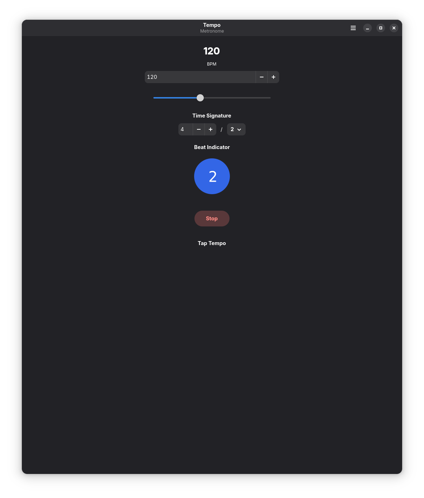
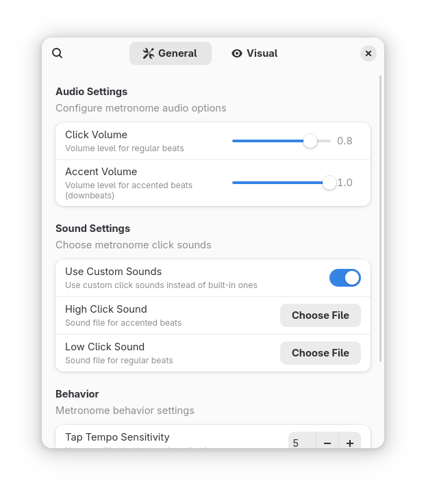
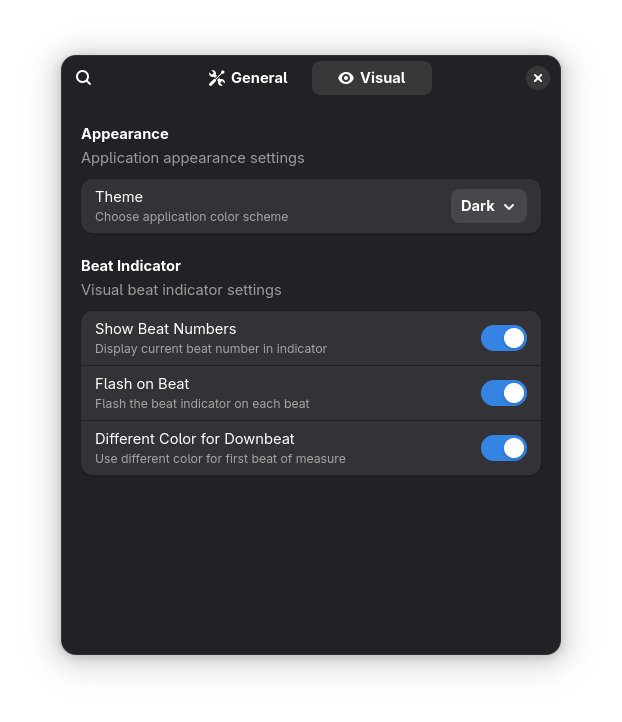
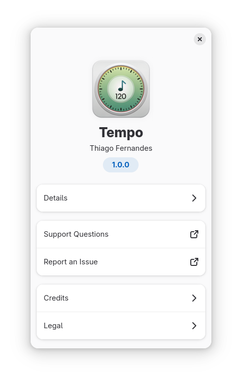

# Tempo
**A Modern Metronome for Musicians**

Tempo is a simple, reliable, and aesthetically pleasing metronome application built with GTK4 and Libadwaita. It provides precise timing, customizable settings, and a distraction-free user experience for musicians of all levels.

## Screenshots

<table>
  <tr>
    <td><br/><em>Main window with tempo controls</em></td>
    <td><br/><em>General preferences</em></td>
  </tr>
  <tr>
    <td><br/><em>Visual preferences with theme selection</em></td>
    <td><br/><em>About dialog</em></td>
  </tr>
</table>

## Features

- **Precise Timing**: Sub-millisecond accuracy with drift-free timing engine
- **Customizable Tempo**: Set BPM from 40 to 240 using slider, stepper, or tap tempo
- **Time Signature Control**: Full support for time signatures with working denominators (4/4, 4/8, 4/2, 4/16, etc.)
- **Visual Beat Indicator**: Clear visual feedback synchronized with audio
- **Accented Downbeats**: Distinct sound for the first beat of each measure
- **Low-Latency Audio**: Optimized GStreamer pipeline for minimal audio delay
- **Modern UI**: Clean, adaptive interface following GNOME design principles
- **Keyboard Shortcuts**: Spacebar to start/stop, arrow keys for tempo adjustment
- **Settings Persistence**: Automatically saves your preferred settings

## Installation

### Flatpak (Recommended)

The easiest way to install Tempo is via Flatpak:

```bash
flatpak install flathub io.github.tobagin.tempo
```

### Building from Source

#### Prerequisites

- Python 3.8 or newer
- GTK4 development libraries
- Libadwaita development libraries
- GStreamer development libraries
- Meson build system
- Blueprint compiler

On Ubuntu/Debian:
```bash
sudo apt install python3-dev libgtk-4-dev libadwaita-1-dev \
    libgstreamer1.0-dev libgstreamer-plugins-base1.0-dev \
    meson blueprint-compiler
```

On Fedora:
```bash
sudo dnf install python3-devel gtk4-devel libadwaita-devel \
    gstreamer1-devel gstreamer1-plugins-base-devel \
    meson blueprint-compiler
```

#### Build Instructions

1. Clone the repository:
```bash
git clone https://github.com/tobagin/tempo.git
cd tempo
```

2. Build with Meson:
```bash
meson setup builddir
meson compile -C builddir
```

3. Install (optional):
```bash
meson install -C builddir
```

#### Development Build

For development, you can build and run locally:

```bash
./build.sh --dev --install
flatpak run io.github.tobagin.tempo
```

## Usage

### Basic Controls

- **Start/Stop**: Click the play button or press `Spacebar`
- **Adjust Tempo**: Use the slider, spin button, or arrow keys (`↑`/`↓`)
- **Tap Tempo**: Click "Tap Tempo" or press `T` repeatedly to set tempo
- **Time Signature**: Set beats per measure and note value

### Keyboard Shortcuts

- `Spacebar`: Start/stop metronome
- `T`: Tap tempo
- `↑`: Increase tempo by 1 BPM
- `↓`: Decrease tempo by 1 BPM
- `Ctrl+Q`: Quit application

### Visual Feedback

The beat indicator shows:
- **Blue circle**: Regular beats
- **Red circle**: Downbeats (first beat of measure)
- **Beat numbers**: Current beat position in measure

## Technical Details

### Architecture

Tempo is built with modern technologies:

- **Frontend**: GTK4 with Libadwaita for native Linux integration
- **UI Definition**: Blueprint markup language for clean, maintainable UI
- **Audio Engine**: GStreamer with optimized low-latency pipeline
- **Timing Engine**: High-precision threading with drift compensation
- **Build System**: Meson for cross-platform building
- **Packaging**: Flatpak for universal Linux distribution

### Precision Timing

The metronome engine uses several techniques to ensure accuracy:

- **Absolute time references** prevent cumulative drift
- **High-resolution performance counter** (time.perf_counter)
- **Compensation for system delays** and sleep interruptions
- **Separate timing thread** to avoid GUI blocking
- **Buffer management** for consistent audio latency

## Development

### Project Structure

```
tempo/
├── data/           # UI files, icons, sounds, schemas
├── src/            # Python source code
├── tests/          # Unit tests
├── packaging/      # Flatpak manifests
├── po/             # Translations
├── meson.build     # Build configuration
└── build.sh        # Convenience build script
```

### Running Tests

```bash
# Run all tests
pytest tests/ -v

# Run with coverage
pytest tests/ -v --cov=src --cov-report=html

# Run specific test file
pytest tests/test_metronome.py -v
```

### Code Style

The project uses:
- **Ruff** for linting and formatting
- **MyPy** for type checking
- **Black** for code formatting

```bash
# Check code style
ruff check src/ tests/
mypy src/ --strict

# Auto-fix issues
ruff check src/ tests/ --fix
```

### Contributing

1. Fork the repository
2. Create a feature branch
3. Make your changes
4. Add tests for new functionality
5. Ensure all tests pass
6. Submit a pull request

## Troubleshooting

### Audio Issues

If you experience audio problems:

1. **Check audio permissions**: Ensure Flatpak has audio access
2. **Verify GStreamer**: Make sure GStreamer plugins are installed
3. **Audio system**: Try switching between PulseAudio and PipeWire
4. **Latency**: Check audio settings in system preferences

### Performance Issues

For timing accuracy problems:

1. **System load**: Close unnecessary applications
2. **Power management**: Disable CPU scaling if possible
3. **Audio buffer**: Adjust buffer sizes in audio settings
4. **Real-time priority**: Some systems may require RT permissions

### Common Solutions

```bash
# Reinstall Flatpak version
flatpak uninstall io.github.tobagin.tempo
flatpak install flathub io.github.tobagin.tempo

# Reset settings
rm -rf ~/.config/tempo

# Check GStreamer plugins
gst-inspect-1.0 | grep audio
```

## License

This program is free software: you can redistribute it and/or modify it under the terms of the GNU General Public License as published by the Free Software Foundation, either version 3 of the License, or (at your option) any later version.

## Contributing

Contributions are welcome! Please see [CONTRIBUTING.md](CONTRIBUTING.md) for guidelines.

## Recent Changes (v1.1.8)

- **Fixed Time Signature Denominators**: Time signature denominators now properly affect beat timing
  - 4/4 = quarter notes get the beat (normal speed)
  - 4/8 = eighth notes get the beat (twice as fast)
  - 4/2 = half notes get the beat (half speed)
  - 4/16 = sixteenth notes get the beat (very fast)
- **Enhanced Musical Accuracy**: Improved beat duration calculation for practice sessions

## Support

- **Bug Reports**: [GitHub Issues](https://github.com/tobagin/tempo/issues)
- **Feature Requests**: [GitHub Discussions](https://github.com/tobagin/tempo/discussions)
- **Documentation**: [Project Wiki](https://github.com/tobagin/tempo/wiki)
