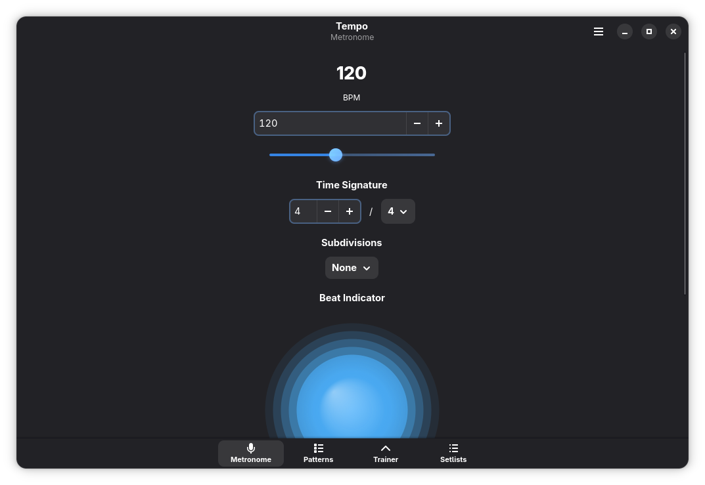
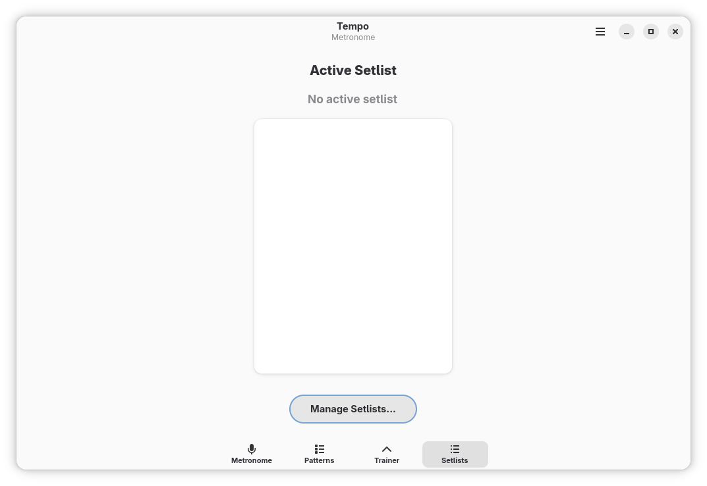
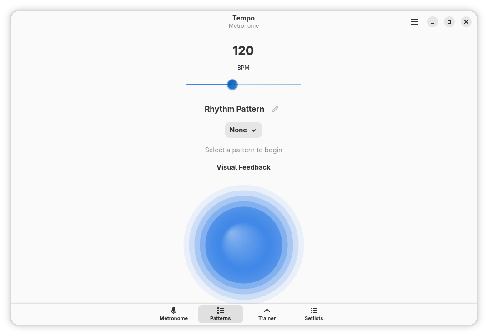
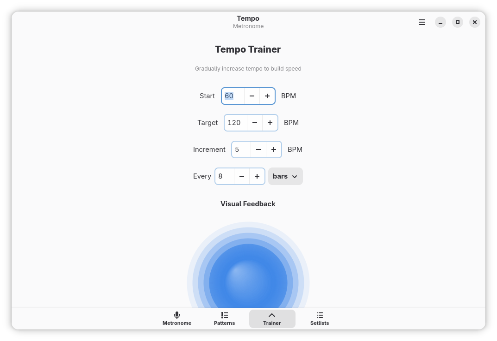
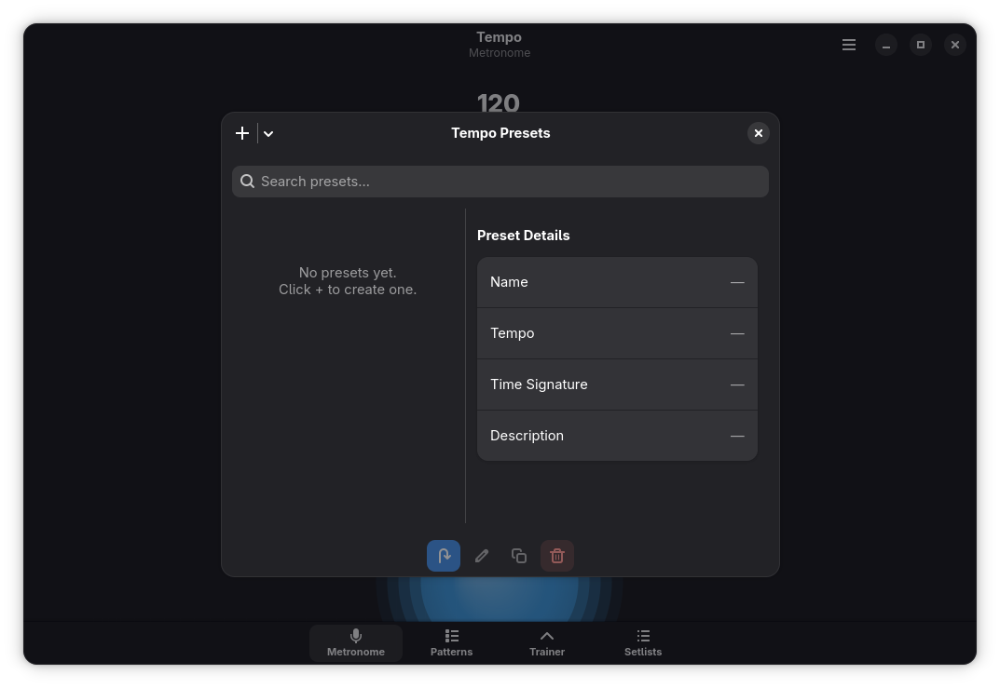
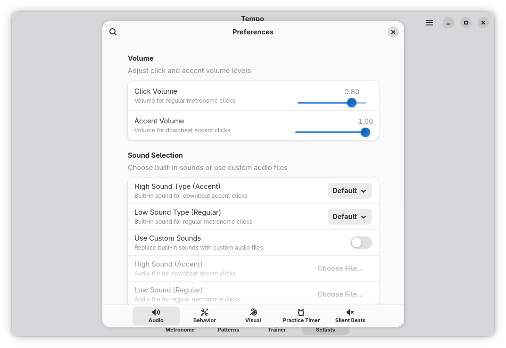
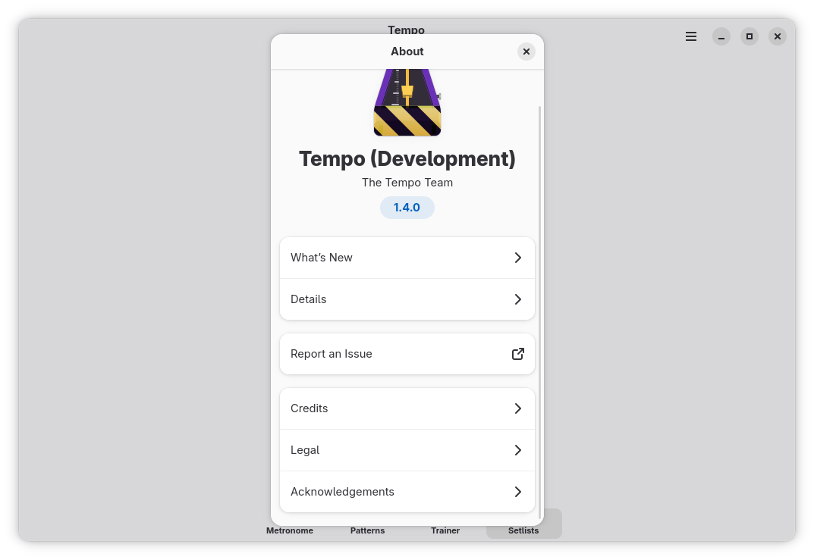

# Tempo

A modern metronome for musicians.

<div align="center">



<a href="https://flathub.org/en/apps/io.github.tobagin.tempo"></a>
<a href="https://ko-fi.com/tobagin"></a>

</div>

## 🎉 Version 1.5.1 - Latest Release

**Tempo 1.5.1** brings metadata improvements and documentation updates.

### ✨ Key Features

- **🚀 Precise Timing**: Sub-millisecond accuracy with a drift-free timing engine
- **📱 Responsive Design**: Fully adaptive layout for mobile, tablet, and desktop
- **🎨 Visual Feedback**: Multiple visual modes (Circle, Pendulum, Bar Graph, etc.)
- **🎹 Rhythm Patterns**: Authentic genre-specific patterns (Clave, Bossa Nova, etc.)
- **⚙️ Advanced Controls**: Tap tempo, custom sounds, and practice timer
- **🔒 Privacy Focused**: No telemetry, all data stays on your machine

### 🆕 What's New in 1.5.1

- **Metadata Improvements**: Verified and improved metainfo validation (summary, description, branding).
- **Documentation**: Simplified README, added Flathub/Ko-Fi badges, and improved build instructions.

### 🆕 What's New in 1.5.0

- **Mobile Support**: Optimized layout for mobile Linux devices like PinePhone and Librem 5.
- **Sound Types**: Built-in Woodblock, Metal, and Digital sound profiles.
- **Improved Denominators**: Better musical accuracy for complex time signatures.
- **Setlists**: Organize your presets into sequences for practice or performance.
- **✨ New Icons**: Fresh new application icons (Thanks to @oiimrosabel).

For detailed release notes and version history, see [CHANGELOG.md](CHANGELOG.md).

## Features

### Core Features
- **High-Precision Timing**: Uses absolute time references to prevent cumulative drift.
- **Dynamic Tempo**: Adjust BPM from 40 to 240 with slider, stepper, or tap tempo.
- **Time Signatures**: Full support for various meters and note values.
- **Rhythm Patterns**: Practice with professional Cuban, Brazilian, Jazz, and Rock patterns.

### User Experience
- **Adaptive Layout**: Reconfigures UI elements for optimal use on any screen size.
- **Visual Modes**: Choose from 5 different animation styles to suit your preference.
- **Shortcuts**: Comprehensive keyboard controls for efficient operation.
- **Practice Timer**: Session tracking with countdowns and auto-stop functionality.

### Privacy & Performance
- **Low-Latency Audio**: Optimized GStreamer pipeline for immediate response.
- **Resource Protection**: Intelligent limiting to ensure stability on all hardware.
- **Local Data**: Presets and setlists are stored locally in standard config paths.
- **Open Source**: Built using modern Vala and GNOME technologies.

## Building from source

```bash
# Clone the repository
git clone https://github.com/tobagin/tempo.git
cd tempo

# Build and install development version
./scripts/build.sh --dev --install
flatpak run io.github.tobagin.tempo.Devel
```

## Usage

### Basic Usage

Launch Tempo from your applications menu or run:
```bash
flatpak run io.github.tobagin.tempo
```

- **Start/Stop**: Click the play button or press `Spacebar`.
- **Adjust Tempo**: Use the slider or arrow keys (`↑`/`↓`).
- **Tap Tempo**: Press `T` repeatedly to set the tempo.

### Keyboard Shortcuts

- `Spacebar` - Start/Stop metronome
- `T` - Tap tempo
- `↑` / `↓` - Increase / Decrease BPM
- `Ctrl+,` - Open Preferences
- `Ctrl+P` - Manage Presets
- `F1` - Show Keyboard Shortcuts


## Privacy & Security

Tempo is designed to respect your privacy:

- **Sandboxed**: Distributed as a Flatpak with minimal necessary permissions.
- **No Tracking**: No telemetry, analytics, or external data reporting.
- **Secure Handling**: Validates all custom audio files and user inputs.

## Contributing

Contributions are welcome! Please see [CONTRIBUTING.md](CONTRIBUTING.md) for guidelines.

- Reporting Bugs: [GitHub Issues](https://github.com/tobagin/tempo/issues)
- Discussions: [GitHub Discussions](https://github.com/tobagin/tempo/discussions)

## License

Tempo is licensed under the [GPL-3.0-or-later](LICENSE).

## Acknowledgments

- **GTK / Libadwaita Team**: For the excellent UI toolkit.
- **GStreamer**: For the powerful multimedia framework.
- **Vala**: For the productive native language.

## Screenshots

| Metronome View | Setlists View | Patterns View |
|:---:|:---:|:---:|
|  |  |  |

| Trainer View | Presets View | Preferences |
|:---:|:---:|:---:|
|  |  |  |

| About Dialog |
|:---:|
|  |

---

**Tempo** - A modern metronome for musicians.
